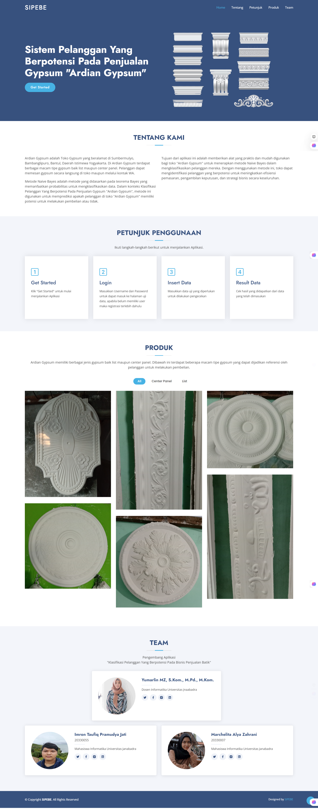
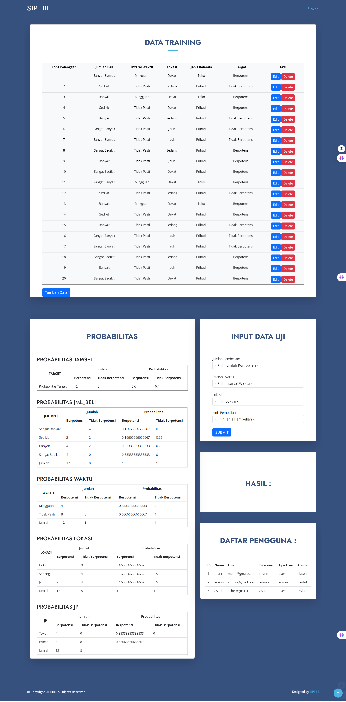

Sistem Pelanggan Yang Berpotensi (SIPEBE)

Deskripsi
Sistem Pelanggan Yang Berpotensi pada penjualan Gypsum "Ardian Gypsum". Menggunakan metode Naive Bayes untuk melakukan klasifikasi, tujuanya adalah membantu pemilik bisnis dalam mengklasifikasikan pelanggan berpotensi dan tidak berpotensi, sehingga dapat memberikan bonus pelanggan berpotensi dan meningkatkan kualitas layanan terhadap pelanggan. Selain itu juga Meningkatkan efektivitas strategi pemasaran dengan menggunakan hasil klasifikasi pelanggan sebagai dasar dalam pengambilan keputusan.

Teknologi yang digunakan:
* php
* bootstrap
* mysql
* metode naive bayes

Fitur:
* Login & Register
* Petunjuk Penggunaan
* Produk
* Tim Pengembang
* Hasil Klasifikasi Naive Bayes

Tampilan:

Halaman SIPEBE

Halaman Login

Halaman Hasil Klasifikasi

